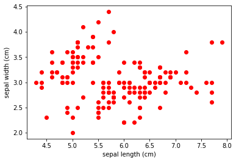
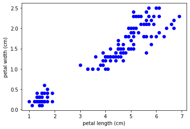
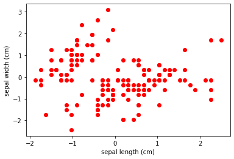
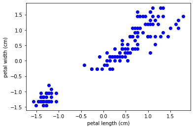

# 1주차 머신러닝 기초
## 이론 문제 1. rainmapmap

### 다음중 Supervised learning과 Unsupervised learning에 대하여 틀리게 설명한 것을 골라 주세요. (답 : 4)

    1. Supervised learning은 지도학습이라고 불리며 특정 사진을 보고 개인지 고양이인지 분류하는 모델을 만들 수 있다.
    2. Unsupervised learning은 비지도학습이라고 불리며 여러 동물 사진을 특징 별로 군집화를 할 수 있다.
    3. Supervised learning은 feature가 여러 개여도 문제없이 학습이 가능하다.
    4. Unsupervised learning은 데이터 중 training set이 없어도 학습이 가능하다
    
1. 지도학습은 분류(Classification)과 회귀(Regression)가 대표적이며,
   사진을 보고 개인지 아닌지 분류하는 모델은 분류(Classifiation)모델임으로 참
2. 비지도학습은 비슷한 특징을 찾아 군집화하는 학습입니다. 사진 군집화는 비지도학습이므로 참
3. 지도학습에서 feature가 많아도 학습이 가능합니다
   다만, feature가 너무 많으면 과적합(Overfitting)으로 이어져, 테스트데이터에서 낮은 정확도를 보여줄 수도 있습니다
4. ✅ 비지도학습은 데이터의 비슷한 특징을 군집화하여 학습을 하므로, **training set이 없으면 학습도 불가**능합니다. 비지도학습은 training set에 target이 없습니다


## 이론 문제 2. DATASET을 구분해보자
### Dataset에 대한 설명 중 틀린 것을 모두 골라 주세요. (답 : 3, 5)

    1. 학습이 끝난 후 모델 평가에 쓰이는 Test set은 Train set에서 사용하지 않은 데이터여야 한다.
    2. 1.의 이유는 평가를 할 때에는 모델이 본 적있는 데이터가 아닌 처음 보는 데이터로 해야하기 때문이다.
    3. Dataset을 Train set : Test set = 1 : 1 비율로 나누면 Overfitting이 발생할 수 있습니다
    4. Overfitting을 방지하기 위한 방법으로 Validation set를 만드는 방법이 있다.
    5. Validation set의 사용 목적은 Test set과 일치한다.
    
1. Test set을 Train Set에서 사용하면 테스트 데이터가 학습이 되어있기 때문에 의도와는 달리 정확도가 높게 나오게 됩니다. 따라서 Test Set은 Train Set과 다른 것이 좋습니다
2. 위의 내용과 동일합니다.
3. ✅ 과적합은 알고리즘이 너무 학습을 꼼꼼히 해서 생기는 문제로, Data Set을 특정 비율로 나누는 것에 대하여 영향을 주지 않습니다 `Train Set의 비율이 적어도 데이터셋이 충분히 크다면 과소적합이 발생하지 않을 수 있습니다.`
4. Validation set은 과적합이 생기지 않는 지점을 판별하기 위해 만들어진 방법입니다
5. ✅ Validation set은 과적합이 생기지 않는 지점을 판별하기 위해 만들어진 방법이지만, **Test se**t은 단순히 **정확도를 측정**하기 위한 Set입니다

## 실습문제 3. 라이브러리폭탄

```python
from sklearn.datasets import load_iris
import matplotlib.pyplot as plt
import pandas as pd

iris = load_iris()
feature_names = iris.feature_names
iris_data = pd.DataFrame(iris.data, columns=feature_names)

def showData(x_index, y_index, color):
  x = iris_data.iloc[:, x_index]
  y = iris_data.iloc[:, y_index]

  plt.scatter(x, y, c=color)
  plt.xlabel(feature_names[x_index])
  plt.ylabel(feature_names[y_index])
  plt.show()

showData(0, 1, 'red')
showData(2, 3, 'blue')
```




## 실습문제 4.

```python
from sklearn.datasets import load_iris
import matplotlib.pyplot as plt
import pandas as pd
import numpy as np

iris = load_iris()
feature_names = iris.feature_names
iris_data = pd.DataFrame(iris.data, columns=feature_names)

def showData(x_index, y_index, color):
  data = iris_data.iloc[:, x_index:y_index+1]

  mean = np.mean(data, axis=0)
  std = np.std(data, axis=0)
  scaled_data = (data - mean) / std

  plt.scatter(scaled_data.iloc[:, 0], scaled_data.iloc[:, 1], c=color)
  plt.xlabel(feature_names[x_index])
  plt.ylabel(feature_names[y_index])
  plt.show()

showData(0, 1, 'red')
showData(2, 3, 'blue')
```




## 실습문제 5. KNN이 뭘까요

```python
from sklearn import datasets,preprocessing
import numpy as np
from matplotlib import pyplot as plt

wine = datasets.load_wine(as_frame=True)

x_scaled = preprocessing.scale(wine.data)

from sklearn.model_selection import train_test_split

x_train, x_test, y_train, y_test = train_test_split(x_scaled, wine.target, test_size=0.25)

from sklearn.neighbors import KNeighborsClassifier

knn = KNeighborsClassifier(n_neighbors=5)

knn.fit(x_train, y_train)
knn.score(x_test, y_test)
```

> **train_test_split**의 test_size는 **전체데이터에 대한 test_data의 비율을 어느정도로 할지 결정**하는 인자입니다.
> test_size의 범위는 0.0부터 1.0으로 나타내며, 설정하지 않으면 설정값이 0.25. 즉 75:25의 비율로 나누도록 설정합니다.

> KNN 알고리즘은 데이터 주위에 있는 K개의 데이터를 이용하여 데이터를 분류하는 알고리즘입니다.
> **KNeighborsClassifier**의 **n_neighbors** 인자는 이때의 **K의 값을 설정**하는 역할을합니다.
> 즉, 데이터 주위에 있는 n_neighbors개의 데이터를 찾아 데이터의 특성을 판별하는 역할을 합니다. 
> 설정하지 않으면 기본값이 5로 설정이 됩니다. 