# 2주차 선형 회귀
## 이론 문제 1.
**💩 다음 중 linear regression 과 Multiple linear regression에 대한 설명으로 틀린 것을 모두 고르세요**
**답 : 2,3,5**

		1.  독립 변수의 개수는?
		2.  가중치의 개수는?
		3.  각 독립변수, 종송변수 간의 관계는?
		4.  선형 회귀 계산 식을 행렬을 이용하여 [A,B]*[C,D]=[E,F]로 표현할 때 B의 값은?
			여기서 [A,B]는 입력 행렬, [C, D]는 가중치 행렬, [E, F]는 출력 행렬이다.
			⚡ [M, N]는 크기가 M×N인 행렬이라는 뜻이다
		5.  4번 행렬에서 B와 C의 관계는?
    
|  | Multiple linear regression | linear regression |
|--|--|--|
| 1 | 여러 개 | 1개 |
| **2** | feature 수만큼 | 없다 -> **feature수만큼 이므로 1개** |
| **3** | 비선형 -> **선형일수도 있고. 아닐수도 있다** | 선형 |
| 4 | 여러 개 | 1개 |
| **5** | B ≠ C -> **행렬 곱 조건에 의해 무조건 B = C** | B == C |
[선형 회귀 - 위키백과, 우리 모두의 백과사전](https://ko.wikipedia.org/wiki/%EC%84%A0%ED%98%95_%ED%9A%8C%EA%B7%80#%EC%84%A0%ED%98%95_%ED%9A%8C%EA%B7%80%EC%97%90_%EB%8C%80%ED%95%9C_%EC%86%8C%EA%B0%9C)


## 이론 문제 2. 평가지표
**💩 다음 중 머신러닝, 딥러닝에서 중요하게 쓰이는 평가 지표에 대한 설명으로 틀린 것을 골라주세요**
**답 : 4**

	1.  모델의 성능을 평가하기 위해선 실제 값과 모델에 의해 예측된 값의 차이를 구해야 하는데 여기서 차이가 작아지는 방향으로 학습을 시켜야한다.
	2.  MSE : 제곱을 하는 방식을 사용하는데 이 때문에 오차에 대해 좀 더 민감하다
	3.  R2 결정계수 : 오차와 R2 결정계수는 비례한
	4.  MAE : 결과 값에 따라 직관적으로 증감을 쉽게 알 수가 있다.
**4. 어디로 편향된지 모름**

## 실습문제 3.
```python
import matplotlib.pyplot as pl
import pandas as pd

[W, B] = [2, 125]

df = pd.DataFrame({
  'Month':[  1,   3,   5,   7,   9,  11],
  'Stock':[130, 128, 132, 140, 153, 150],
})

df['StockExp'] = W * df['Month'] + B
df['SE'] = (df['Stock']-df['StockExp'])**2
MSE = df['SE'].mean()

for data in df.to_numpy():
  print(data[0], "월 주가 =", str(data[1])+",", "예측 주가 =", data[2])
print("최종 mse:", MSE)
print("12월 예상 주가 :", W * 12 + B)

pl.scatter(df['Month'].to_numpy(), df['Stock'].to_numpy(), c='r')
pl.plot([1, 12], [127, W*12+B])
pl.xlabel('Month')
pl.ylabel('Stock')
pl.show()

```

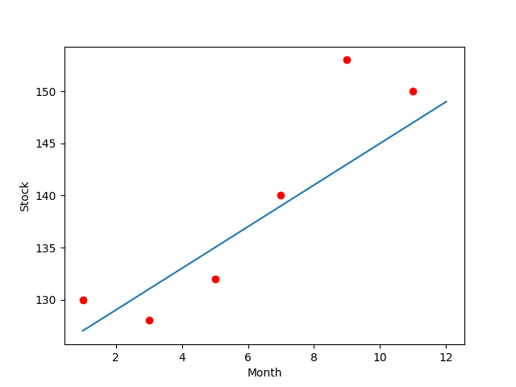
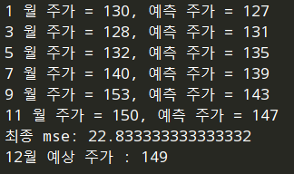

## 이론문제 4.
**💩 Ridge , Lasso 에 대한 설명으로 옳은 것을 고르세요**
**답 : 4**

	1. Regularization 중 Ridge, Lasso말고 흔하게 부르는 다른 이름은?
	2. 변수 사이의 상관 관계가 높은 데이터 일수록 예측력이~?
	3. 잔차제곱합을 사용하나?(잔차제곱합 = MSE)
	4. 방향성?
	5. 과대적합 과소적합

|  | Ridge | Lasso  |
|--|--|--|
| 1 | L1 Regularization -> **L2** | L2 Regularization -> **L1** |
| 2 | 낮다 -> **좋은성능** | 높다 -> **낮은성능** |
| 3 | 한다 | 안한다❌ |
| **4** | 학습에 영향을 주지 않는 가중치를 0에 가깝게 한다 |학습에 영향을 주지 않는 가중치를 0에 수렴하게 하여 bias를 크게 한다. |
| 5 | 과대적합 방지 O 과소적합 가능성 ⬆️❌ | 과대적합 방지 O 과소적합 가능성 ⬇️❌ |
~~5번 과소적합과는 관계없는 모델입니다. 릿지 라소는 과대적합을 방지하기 위한 모델일 뿐...??~~

## 실습문제 5. KNN 실습

[Google Colaboratory](https://colab.research.google.com/drive/1Ljpx5AnZx91eUcD68YWLdj45JVdmXmRu?authuser=2#scrollTo=St3f7t5kGW-6)

```python
import pandas as pd
wine=pd.read_csv("<http://bit.ly/wine-date>")

# 시각화 해보기
import seaborn as sns

sns.histplot(x=wine['alcohol'])
sns.boxplot(x=wine['alcohol'])
sns.histplot(wine['sugar'])
sns.boxplot(wine['sugar'])
sns.histplot(wine['pH'])
sns.boxplot(wine['pH'])

#target값 확인해보기
sns.countplot(wine['class'])
print("Target Class :", pd.unique(wine['class']))

# 데이터 관계 확인하기
sns.scatterplot(x='alcohol', y='pH', size='sugar', hue='class', data=wine)
sns.jointplot(x='alcohol', y='pH', data=wine, kind='scatter')
sns.jointplot(x='alcohol', y='pH', data=wine, kind='hex')

## 학습 테스트 모델 나누기
from sklearn.model_selection import train_test_split

wine_input = wine[['alcohol', 'sugar', 'pH']].to_numpy()
wine_target = wine['class'].to_numpy()

train_input, test_input, train_target, test_target = train_test_split(wine_input, wine_target)

# 전처리
from sklearn.preprocessing import StandardScaler

scaler = StandardScaler()
scaler.fit(train_input)
train_scaled = scaler.transform(train_input)
test_scaled = scaler.transform(test_input)

# 모델링 KNN
from sklearn.neighbors import KNeighborsClassifier

knn = KNeighborsClassifier(n_neighbors=3)
knn.fit(train_scaled, train_target)
print("Train Score :", knn.score(train_scaled, train_target))
print("Test Score :", knn.score(test_scaled, test_target))
print()
print("Test Classification :", knn.predict(test_scaled[:5]))

```

	 🖥️	 Target Class : [0. 1.]
		 Train Score : 0.9238505747126436
		 Test Score : 0.8603076923076923
		 Test Classification : [1. 1. 1. 0. 1.]


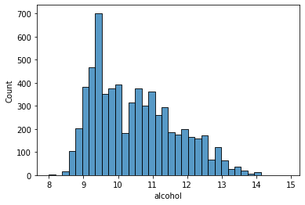
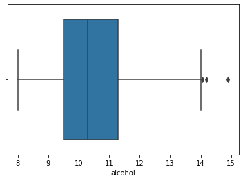


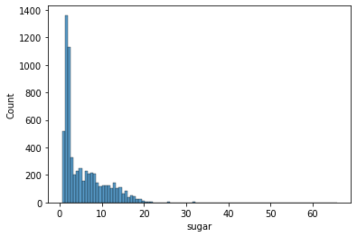
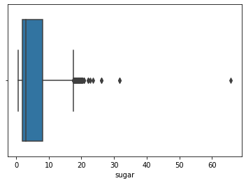


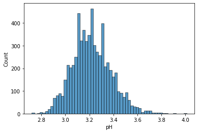
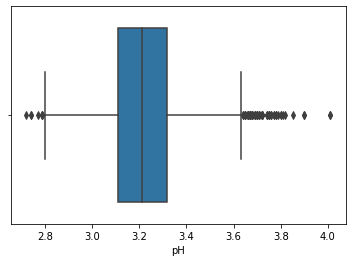


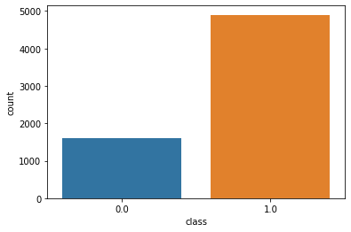
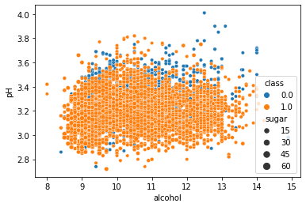


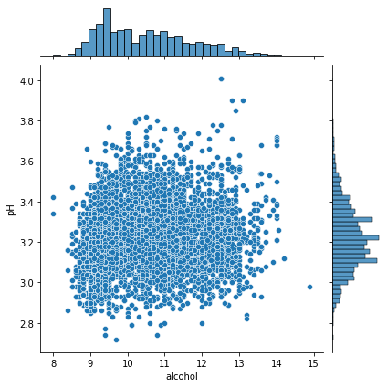
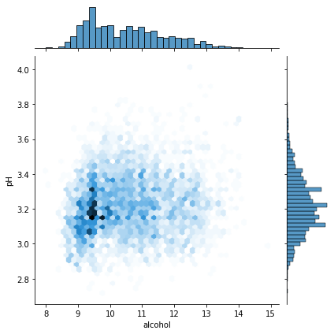