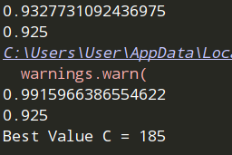
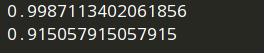

# 4주차 트리 알고리즘

## 이론문제 1
**다음 중 결정 트리에 관한 질문 중 틀린 것을 모두 고르시오.**
**답: 3, 5**

	1.  결정 트리 알고리즘은 부모와 자식 노드 사이의 불순도 차이가 최대화되도록 학습한다.
	2.  결정트리에 아무 파라미터도 주지 않은 채 학습하면 오버피팅된다
	3.  이진 분류에서 지니 불순도의 최대 값은 0.5이고 클수록 분류하기 좋지 않고, 엔트로피 불순도는 낮을수록 분류하기 좋지 않다.
	4.  결정트리에서 특성 중요도는 분류를 순수하게 잘 한 기여도이고, 특성 중요도가 높을 수록 해당 노드가 중요한 분류 기준이라는 것을 의미한다.
	5.  특성 중요도가 낮다는 것은 유용하지 않은 특성이다. **- 결정에 많은 영향을 주지 않는다?**
3. 불순도는 양성데이터와 음성데이터의 개수차이가 얼마나 나는지를 수치화 한 것으로 **분류하기 좋은 것** 보다는 **분류가 잘 된 것**이라 하는게 맞는 것 같다. 또한 엔트로피 불순도 또한 **낮을 수록 분류가 잘 된 것**이다. 
5. 단지 그 특성을 선택하지 않았을 뿐, 다른 특성이 동일한 정보를 가져서 일 수도 있다.

## 이론 문제 2
**다음 내용 중 틀린 설명을 모두 고르시오.**
**답: 3, 4**

	1.  집단의 데이터 개수만큼을 복원 추출하는 bootstrap은 모집단과 표본 집단을 추정 가능하게 한다.
	2.  Histogram-based Gradient Boosting은 정형 데이터를 높은 성능으로 다룬다.
	3.  트리의 랜덤성이 클수록 방대한 양의 트리를 훈련해야 하기 때문에 필연적으로 계산 속도가 느려지는 문제가 발생한다.
	4.  random forest에서 각각의 트리는 오버피팅될 수 있으나 각 트리의 연관성이 높을수록 random forest의 성능이 높아진다.
	5.  회귀와 분류 모두에 이용 가능한 gradient boosting은 손실 함수, 약한 학습자들을 포함한다.

3. 트리의 랜덤성이 크면 성능이 좋아집니다. 대표적인 예로 엑스트라 트리
4. Random Forest는 과대적합이 있는 트리가 있으면, 다른 쪽으로 과대적합이 되게 하여, 과대적합을 막는 알고리즘이므로, 트리의 연관성이 없을 수록 성능이 높아진다고 할 수 있다.

## 실습 문제 3
**GridSearchCV를 알게된 혼공머신은 04-1에서 로지스틱 회귀를 이용하여 생선의 종을 분류하는 모델의 C값이 적절한 값인지 궁금해졌다. 기존의 코드에서 GridSearchCV를 추가하여 C값이 변화하였는지 확인해보자.**

```python
import pandas as pd

fish = pd.read_csv('<https://bit.ly/fish_csv_data>')

fish_input = fish[['Weight','Length','Diagonal','Height','Width']].to_numpy()
fish_target = fish['Species'].to_numpy()

#data split
from sklearn.model_selection import train_test_split

train_input, test_input, train_target, test_target = train_test_split(
    fish_input, fish_target, random_state=42)

#preprocessing
from sklearn.preprocessing import StandardScaler

ss = StandardScaler()
ss.fit(train_input)
train_scaled = ss.transform(train_input)
test_scaled = ss.transform(test_input)

#LR
from sklearn.linear_model import LogisticRegression

lr = LogisticRegression(C=20, max_iter=1000)
lr.fit(train_scaled, train_target)

print(lr.score(train_scaled, train_target))
print(lr.score(test_scaled, test_target))

```

**출력**

GridSearchCV를 적용하기 전과 적용한 후의 train, test의 score를 출력하고, GridSearchCV가 찾은 C값이 기존의 C값과 다른지 출력해주세요.

```python
from sklearn.model_selection import GridSearchCV
import numpy as np

params = {'C' : np.arange(1, 200)}
gs = GridSearchCV(LogisticRegression(max_iter=1000), params, n_jobs=-1)
gs.fit(train_scaled, train_target)
bestLR = gs.best_estimator_
print(bestLR.score(train_scaled, train_target))
print(bestLR.score(test_scaled, test_target))
print("Best Value C =", gs.best_params_['C'])

```



`🎁 로지스틱 회귀는 C값이 작을 수록 규제가 심해지므로 최적의 값을 찾을 때 C값의 범위를 줄여야 함`

## 이론 문제 4
**다음 중 결정 트리에 관한 질문 중 틀린 것을 모두 고르시오.**
 **답: 2, 3, 6**

	1.  8-겹 교차 검증을 사용할 때 훈련에 사용되는 데이터는 전체 데이터의 87.5%이다.
	2.  모델에서 각각의 하이퍼파라미터는 독립적으로 모델의 성능에 영향을 미친다.
	3.  Leave One Out Cross Validation은 Leanear regression과 polynomial regression 모델에서 더 느린 연산 속도를 가진다.
	4.  K-fold cross validation은 LOO cross validation에 비해 연산량이 적다.
	5.  Validation set Approach는 LOO cross validation에 비해 bias가 높다.
	6.  LOO cross validation는 모든 특성을 validation으로 사용하기 때문에 Variance은 낮다.

2. 독립적인 하이퍼파라미터도 있지만, 종속적인 하이퍼파라미터도 있다
3. 교차 검증 연산 속도 = 모델의 속도
6. LOOCV는 과대적합되는 경향이 있으므로, Variance은 높다.

## 실습 문제 5

혼공이는 밤하늘을 보던 와중에 갑자기 행성의 측정 방법이 궁금해졌다. 어떤 행성을 어떤 방법으로 측정할지 한번 알아보자. 혼공이는 예측 과정을 이해하기 쉽게 결정 트리 모델을 사용하기로 결정했다. (단, Grid Search는 사용하지 않는다.)


```python
<시작 코드>
from sklearn import datasets
import pandas as pd
import seaborn as sns
planets=sns.load_dataset('planets')

```

----------

**출력**

0.9939613526570048 0.9371980676328503

다음과 같은 훈련 세트와 테스트 세트의 score값과 결정트리 그래프를 출력해주세요.

```python
from sklearn.model_selection import train_test_split
from sklearn.tree import DecisionTreeClassifier
import matplotlib.pyplot as plt
from sklearn.tree import plot_tree
RAND = 81

planets = planets.fillna(0)
planets_input = planets[['number', 'orbital_period', 'mass', 'distance', 'year']]
planets_target = planets['method']

train_input, test_input, train_target, test_target = train_test_split(planets_input, planets_target, random_state=RAND)

dt = DecisionTreeClassifier(random_state=RAND)
dt.fit(train_input, train_target)
print(dt.score(train_input, train_target))
print(dt.score(test_input, test_target))

plot_tree(dt)
plt.show()

```




`과대적합을 줄이는 게 중요하다`